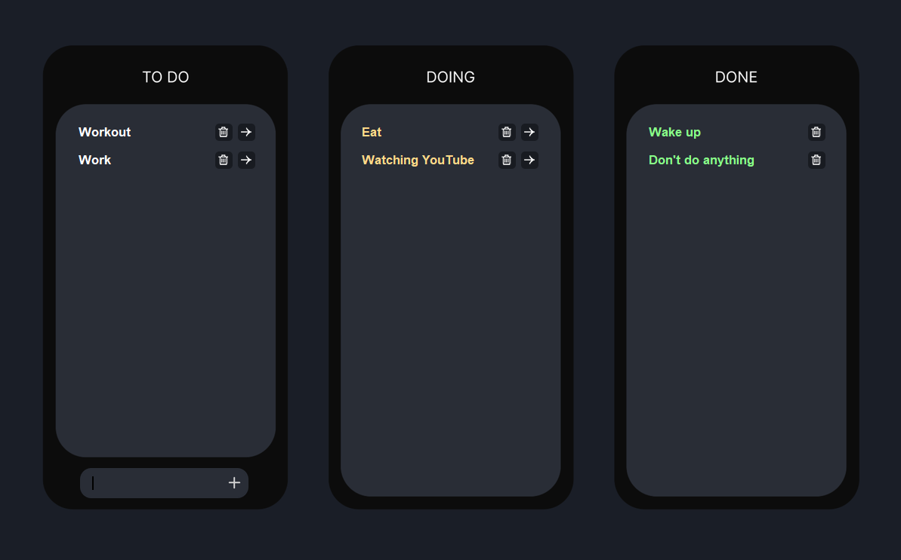

# Kanban To-Do App

A simple Kanban-style task manager built with Python, Tkinter, Tkinter Designer, and SQLite.

You can add tasks, move them between "To-Do", "Doing", and "Done", and delete them when you're finished. Tasks are saved locally using a SQLite database.


---

## Features

- Kanban layout (To-Do / Doing / Done)
- Add, move, and delete tasks
- Local database (SQLite) — data is saved between sessions
- Custom UI with simple graphics

---

## How to Run

1. Clone this repo:
    ```bash
    git clone https://github.com/hesoom/kanban-todo.git
    cd kanban-todo-app
    ```
2. Run the app:
    ```bash
    python main.py
    ```

---
    
### Project Structure

- `main.py`  Core application logic and UI layout  
- `task.py`  Task component (each task's UI and behavior)  
- `utils.py`  Utility function for resolving asset paths  
- `task.db`  SQLite database (created on first run)  
- `assets/`  UI images (buttons, background, etc.)

### Notes
- No external libraries needed. Everything is built using Python’s standard libraries.
- Feel free to use or tweak the design and features.

Made by Hesam
